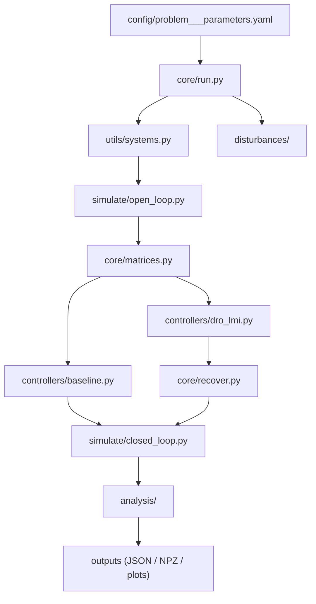

# Distributionally-Robust Output-Feedback Control  
### (Baseline Monte Carlo H₂ vs. DRO-LMI)

This repository implements two pipelines for discrete-time output-feedback controller synthesis and evaluation:

1. **Baseline** — stochastic H₂ optimization via Monte Carlo simulation  
2. **DRO-LMI** — distributionally-robust control synthesis via convex LMIs and controller recovery  

Both pipelines operate on the same plant model and share simulation and evaluation tools.

---

## 🧭 Repository Structure

```
.
├── main.py                     # CLI entry point
├── config/                     # Configuration handling
│   ├── loader.py
│   └── problem___parameters.yaml
│
├── controllers/                # All control design methods
│   ├── baseline.py
│   ├── dro_lmi.py
│   ├── dro_deepc.py
│   ├── dro_young.py
│   ├── dro_youngschur.py
│   ├── dro_estm.py
│   └── non_convex/             # Experimental / non-convex methods (e.g. WFL)
│
├── core/                       # Core pipeline logic
│   ├── run.py                  # Main orchestration
│   ├── matrices.py             # Closed-loop matrix construction
│   └── recover.py              # Controller recovery from LMI variables
│
├── disturbances/               # Disturbance modeling (Wasserstein, Gaussian, etc.)
│   ├── disturbances.py
│   ├── _wasserstein.py
│   ├── _metric_2w.py
│   ├── _gaussian.py
│   └── _zero.py
│
├── simulate/                   # Simulation pipeline
│   ├── open_loop.py
│   ├── closed_loop.py
│   └── initial_conditions.py
│
├── analysis/                   # Evaluation and metrics
│   ├── Comparator.py
│   ├── SNR.py
│   ├── Nsims_eval.py
│   ├── Nsims_mat.py
│   └── find_opt_gamma.py
│
├── utils/                      # Shared utilities
│   ├── systems.py              # Plant / Controller classes
│   ├── directory.py            # Output management
│   ├── plot.py
│   └── gamma_selection.py
│
├── experiments/                # Experiment configs / runs
├── docs/                       # Documentation / reports
├── .gitignore
└── README.md
```

---

## ⚙️ How It Works

### Overview

| Mode | Description | Command |
|------|------------|--------|
| **Baseline** | Monte Carlo H₂ optimization | `python main.py --base` |
| **DRO-LMI** | Distributionally robust LMI synthesis | `python main.py --lmi` |

---

## 🔄 Pipeline Overview



---

## 🧠 Baseline Monte-Carlo H₂ Method

**Goal:**
J = E[||z_t||²]

**Procedure:**
1. Initialize controller parameters  
2. Build closed-loop matrices via `core/matrices.py`  
3. Simulate trajectories (`simulate/closed_loop.py`)  
4. Estimate cost via Monte Carlo  
5. Optimize with L-BFGS-B  
6. Penalize instability if needed  

---

## 🧮 DRO-LMI Method

**Goal:**  
Minimize worst-case H₂ cost under a Wasserstein ambiguity set.

**Steps:**
1. Construct lifted matrices (`core/matrices.py`)  
2. Define LMI constraints (controllers/dro_*.py)  
3. Solve via CVXPY (MOSEK / SCS)  
4. Recover controller (`core/recover.py`)  
5. Simulate and evaluate  

---

## 🌊 Disturbance Modeling

Handled in `disturbances/`:

- Gaussian nominal models  
- 2-Wasserstein ambiguity sets  
- Independent vs correlated noise  
- Projection and sampling utilities  

---

## 📊 Analysis & Metrics

Implemented in `analysis/`:

- Closed-loop cost J  
- Signal-to-noise ratio (SNR)  
- Multi-simulation statistics  
- Optimal γ search utilities  

---

## ⚙️ Configuration

Main file:

config/problem___parameters.yaml

---

## ▶️ Running Experiments

### Baseline
python main.py --base

### DRO-LMI
python main.py --lmi

---

## 📦 Outputs

Generated automatically:

- .json → metadata  
- .npz → trajectories  
- .pdf → plots  

---

## 🧠 Dependencies

- Python ≥ 3.10  
- NumPy, SciPy, Matplotlib  
- CVXPY (MOSEK or SCS)  
- PyYAML  

---

## 🧾 Notes

- `_OLD/` is deprecated and ignored  
- `__pycache__/` is excluded via `.gitignore`  
- Non-convex methods are experimental  

---

## 🧾 Citation

Hybrid Baseline & DRO-LMI Pipeline for Robust Output-Feedback Control (2025)
